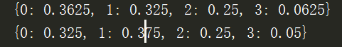
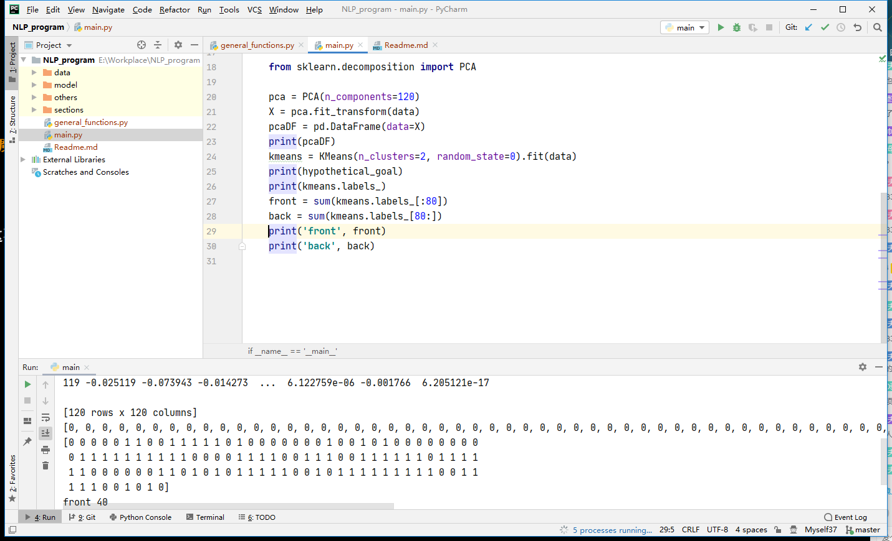

#个人笔记及问题总结

+ [x] 文本清洗 2020.6.22  
没什么说的，小问题在于re模块有些地方还是不太理解  
比如：  
```python3  
def delete_punctuations(text, replace=''):
    import re
    from zhon.hanzi import punctuation
    text = re.sub(r"[%s]+" % punctuation, replace, text)
    for i in OTHER_PUNCTUATIONS:
        text = text.replace(i, '')
    for i in OTHER_PAIRS:
        text = text.replace(i, '')
    return text
```
我尝试使用`punctuation + OTHER_PUNCTUATIONS`来代替一大堆replace（因为个人觉得性能偏差，要多次遍历，但是也懒得自己造轮子）  
不过失败了，后面发现文本量还算小，replace不足以影响效率，所以无所谓了  
+ [x] 提取gram及TF-INF 2020.6.23  
本来打算自己造轮子（参见`N_gram`函数），已经写了大半之后发现群里同学用了sklearn的现成轮子...  
遂转用现成轮子。  
然而，这个轮子让我折腾了一晚上，CSDN很多文章都还是不靠谱。最终还是靠着 [官方文档](https://scikit-learn.org/stable/modules/generated/sklearn.feature_extraction.text.CountVectorizer.html#sklearn.feature_extraction.text.CountVectorizer.fit_transform) 才得以解决  
不过最后的数据结构有点和我自己设计的不太一样，不过整理一下应该还算好用  
此外，使用sklearn时，sklearn自动去除了一些单字（如下图），对结果影响暂且不知，留作以后分析。  


+ [x] 提取各个章节特征 2020.6.24  
今天发现...好像直接整体提取是一样的蛤  
之前是按照自己的逻辑先整体提取所有feature 然后再各章节对应构建特征向量  
然而发现只要把每个章节分开，做成如下形式`[section1,section2....section120]`  
sklearn的库就会自动构建一个`120 * (gram_nums)`的矩阵  
测试无误后扔在这里备档：  
  
至此数据预处理完毕，之后就是分类/聚类了  
目前的想法是，先不使用分类方法（因为需要进行打标,个人对80/40之说保持怀疑态度）  

+ [x] 章节特征初分类 2020.6.24  
使用K-means进行聚类  
结果如下:  
  
下面的120个是分类结果，前80回恰好被一分为二，后40回有基本也是一分为二，基本上是说明不了问题。  
在参考 @zy 同学的指导之后，考虑到文本特征向量极其稀疏，并且忽视了词语之间的关联性，考虑将其进行降维。  
并且从 @slx 同学处得知，使用词性标注分类基本也是无果（下图为词性标注后聚四类结果，分别为前80回合后40回分类分布）  
  
于是增加后续任务（于"使用其他模型分类之后"的目标）
+ [x] 进行数据降维后再分类  2020.6.24  
降维到120维之后结果仍旧很一般（不过知道了PCA降维的最小值为`min(n_samples, n_features)=120`）  
结果如下：  
  
2020.6.25  
发现是自己调用数据有些许问题，调整为正确代码，结果相对好了一点：  
  
可以理解为进行数据压缩之后文本之间相互的关联性更强了，所以效果更好了。  
但是依旧不是特别能够说明问题。  
压缩为3维进行尝试，结果没有变化(甚至更模糊了）：  
  

+ [x] 使用其他模型进行分类  2020.6.26    
使用谱聚类算法（spectral clustering）  
谱聚类对数据分布的适应性更强，聚类效果也很优秀，同时聚类的计算量也小很多。此外，这个方法对于稀疏矩阵的效果据说十分之良好（本身带降维）。    
当降维到100维时的结果：  
  
然，差距仍旧只有不到5%，应该就是基本没有区别了。  
尝试使用其他聚类方法(顺带调整了代码结构)：  
   
+ [x] 调整N-gram模型，使用其他编码的特征向量  2020.6.27  
当N=2时，基本无变化：  
   
调整使用单字为gram(N=1,2,3)： 
N=1,2,3时均无明显差距：
   
   
   

+ [ ] （如果真的有空）使用神经网络训练


mark html  
[流程](https://blog.csdn.net/shuihupo/article/details/80931194?utm_medium=distribute.pc_relevant.none-task-blog-BlogCommendFromMachineLearnPai2-1.nonecase&depth_1-utm_source=distribute.pc_relevant.none-task-blog-BlogCommendFromMachineLearnPai2-1.nonecase)  
[理论](https://blog.csdn.net/dulpee/article/details/88202473)  
[sklearn官方文档](https://scikit-learn.org/stable/modules/generated/sklearn.feature_extraction.text.CountVectorizer.html#sklearn.feature_extraction.text.CountVectorizer.fit_transform)  
[聚类方法](https://blog.csdn.net/qq_40587575/article/details/82694170)  
[知乎上的做法](https://zhuanlan.zhihu.com/p/21807356)  
  
Note from teacher   
调整N-gram  
PCA 选择主成分 （占原有比例），弱均匀，则不好 TSNE
